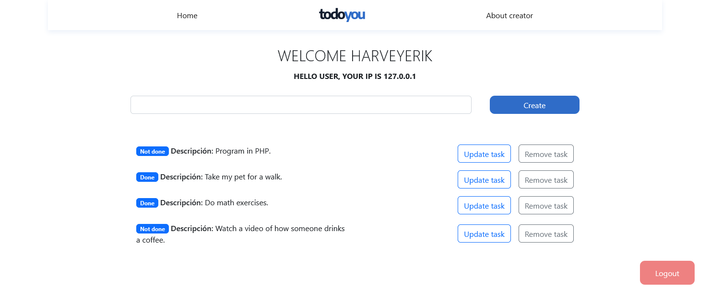

# todoyou - task app
A simple application, developed with the python micro framework, Flask, and also uses Firestore as a database.

## How to use the app 🧱
1. Clone the repository.  
`git clone https://github.com/YerikAH/todoyou-fullstack.git`
1. Move to directory.   
`cd todoyou-fullstack`
1. Create virtual environment.   
`python3 -m venv venv`
1. Activate the virtual environment.  
`source venv/bin/activate`
1. Install app requirements.  
`pip install -r requirements.txt`
1. Use the app.  
`source deploy.sh`
## Screenshots

   
   
   
   

## Technologies used in the project 🛠 

- Flask
- Bootstrap
- Firestore
- HTML(Jinja), CSS, JavaScript

## Demo 💻 

In your browser: http://127.0.0.1:5000
